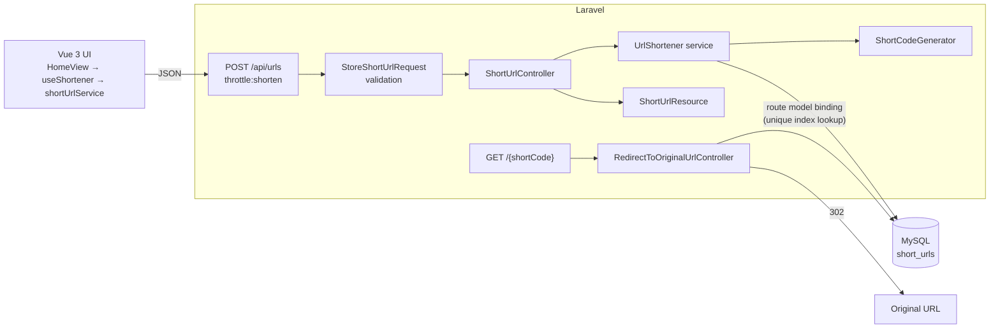

# URL Shortener

A small URL shortening service built with **Laravel**, **MySQL** and **Vue 3**. Paste a long link, get a short one back, and visiting the short link redirects to the original.

The scope is intentionally small. The goal was to build it the way I would build a feature in a real business system: validated at the boundary, protected by the database, covered by tests that prove behaviour, and documented so another developer can pick it up.


---

## Contents

- [Features](#features)
- [Tech stack](#tech-stack)
- [Architecture](#architecture)
- [Requirements](#requirements)
- [Installation](#installation)
- [Running locally](#running-locally)
- [Testing](#testing)
- [API documentation](#api-documentation)
- [Database design](#database-design)
- [Design decisions](#design-decisions)
- [Security considerations](#security-considerations)
- [Trade-offs](#trade-offs)
- [Future improvements](#future-improvements)

## Features

- Shorten any `http://` or `https://` URL up to 2,048 characters.
- Random, unpredictable 7-character alphanumeric codes (e.g. `Ab12X9z`).
- Uniqueness enforced by a database `UNIQUE` index, with automatic retry on collision.
- `302` redirect from `/{shortCode}` to the original URL; `404` for unknown codes.
- Consistent JSON API with proper status codes (`201`, `422`, `429`, `500`).
- Per-IP rate limiting on the shortening endpoint.
- Vue 3 interface with loading, validation, network/server error, copy-to-clipboard and reset states.
- Accessible: labelled input, errors announced to screen readers and not conveyed by colour alone, keyboard-friendly focus handling.
- Backend (PHPUnit) and frontend (Vitest) test suites, plus a GitHub Actions workflow that runs them against MySQL 8.

## Tech stack

| Layer    | Technology                                    |
| -------- | --------------------------------------------- |
| Backend  | PHP 8.3, Laravel 13                           |
| Database | MySQL 8 (MariaDB 10.11 also works)            |
| Frontend | Vue 3 (Composition API), Vite 8, Tailwind CSS 4 |
| Testing  | PHPUnit 12, Vitest, Vue Test Utils            |
| Tooling  | Laravel Pint, GitHub Actions                  |

## Architecture

Laravel serves both the API and the single Blade page that mounts the Vue app, so the frontend and backend share one origin. That keeps deployment to a single app and removes the need for CORS configuration.



### Backend

| File | Responsibility |
| ---- | -------------- |
| `routes/api.php`, `routes/web.php` | Endpoint definitions. The redirect route is constrained to `[A-Za-z0-9]{6,8}`, so other paths never reach the database. |
| `app/Http/Requests/StoreShortUrlRequest.php` | All input validation and user-facing messages. |
| `app/Http/Controllers/Api/ShortUrlController.php` | Thin controller: validated input in, resource out. |
| `app/Services/UrlShortener.php` | Persists a URL under a unique code, retrying on collision. |
| `app/Services/ShortCodeGenerator.php` | Generates random codes with a CSPRNG (`random_int`). Pure and unit-tested. |
| `app/Http/Resources/ShortUrlResource.php` | The JSON shape returned to clients. |
| `app/Http/Controllers/RedirectToOriginalUrlController.php` | Resolves a code through route model binding and redirects. |
| `app/Models/ShortUrl.php` | Eloquent model with explicit `#[Fillable]` attributes. |

I used a service class only where there is real logic (code generation and the retry loop). There is no repository layer or interface, because Eloquent already is the data-access abstraction and there is only one implementation.

### Frontend

```
resources/js/
├── app.js                      # Mounts the app
├── App.vue                     # Page layout
├── views/HomeView.vue          # Composes the form and result, manages focus
├── components/
│   ├── ShortenForm.vue         # Input, submit button, field error
│   └── ShortUrlResult.vue      # Short link, copy button, reset
├── composables/
│   ├── useShortener.js         # Submit flow state: loading, errors, result
│   └── useClipboard.js         # Copy with copied/failed feedback
├── services/shortUrlService.js # fetch() wrapper that normalises API errors
└── utils/url.js                # Client-side URL validation (mirrors the server)
```

Components only render and emit events. API communication lives in one service that turns every failure (validation, rate limit, server error, network error, non-JSON response) into an `ApiError` with a message that is safe to show, so no raw exception ever reaches the UI.

## Requirements

Verified in this project:

- PHP **8.3+** with `pdo_mysql` (Laravel 13 requires 8.3)
- Composer 2
- MySQL **8.0+** or MariaDB **10.11+**
- Node.js **20.19+ or 22.12+** (required by Vite 8) and npm

## Installation

```bash
git clone https://github.com/SyafiqahShahrom/url-shortener.git
cd url-shortener

composer install
cp .env.example .env
php artisan key:generate

npm install
```

### Database setup

Create a database (utf8mb4), then set the credentials in `.env`:

```sql
CREATE DATABASE url_shortener CHARACTER SET utf8mb4 COLLATE utf8mb4_unicode_ci;
```

```dotenv
DB_CONNECTION=mysql
DB_HOST=127.0.0.1
DB_PORT=3306
DB_DATABASE=url_shortener
DB_USERNAME=root
DB_PASSWORD=
```

Run the migrations:

```bash
php artisan migrate
```

### Environment variables

| Variable | Purpose |
| -------- | ------- |
| `APP_URL` | Base URL of the app. Short links are built from the incoming request's host; `APP_URL` is used for console-generated URLs and to reject shortening the app's own links. |
| `APP_DEBUG` | Must be `false` in production so errors return a generic message instead of a stack trace. |
| `DB_*` | MySQL connection. |
| `SHORTENER_RATE_LIMIT_PER_MINUTE` | Max shorten requests per client IP per minute (default `20`). |

No secrets are committed; `.env` is git-ignored and `.env.example` contains placeholders only.

## Running locally

Run the Laravel server and the Vite dev server in two terminals:

```bash
php artisan serve      # http://localhost:8000
npm run dev            # Vite with hot reload
```

Then open http://localhost:8000.

To run without Vite, build the assets once instead:

```bash
npm run build
php artisan serve
```

## Testing

### Backend

```bash
php artisan test
```

By default `phpunit.xml` runs the suite on in-memory SQLite, so it needs no setup. To run it against MySQL (recommended, since the case-sensitive short code behaviour depends on the MySQL column collation), point it at an empty test database:

```bash
DB_CONNECTION=mysql DB_DATABASE=url_shortener_test php artisan test
```

Code style:

```bash
vendor/bin/pint --test
```

### Frontend

```bash
npm test
```

### What the tests cover

**Backend (37 tests)** in `tests/Feature` and `tests/Unit`:

- A valid URL is shortened, persisted and returned with the documented JSON shape and `201`.
- Empty, whitespace-only, missing, malformed, non-string and over-long URLs return `422` and persist nothing.
- `javascript:`, `data:`, `file:` and `ftp:` URLs, embedded newlines (header injection) and embedded HTML are rejected.
- A URL exactly at the 2,048-character limit is accepted.
- SQL-like input is stored verbatim (parameter binding).
- Shortening one of this app's own links is rejected.
- **Collision handling:** a generator forced to return an existing code retries, and the existing record is never overwritten.
- **Retry exhaustion** returns a generic `500` (`{"message":"Server Error"}`), reports the exception, and leaks no details.
- Rate limiting returns `429` once the limit is reached.
- Redirect returns `302` to the stored URL; unknown and malformed codes return `404`.
- Codes are case-sensitive (`AbCdEf1` ≠ `abcdef1`). This test fails on MySQL if the binary collation is removed from the migration.
- The generator produces codes of the right length and alphabet, supports 6–8 characters and rejects anything else.

**Frontend (27 tests)** in `tests/js`:

- Successful shortening shows the short link and moves focus to the result.
- The button is disabled with a "Shortening…" label while the request is pending, and repeat submissions are ignored.
- Empty and malformed URLs are caught client-side without calling the API.
- Server validation errors appear next to the input; network/server failures appear as an alert.
- Copy to clipboard shows success, and a fallback message when the clipboard is unavailable.
- "Shorten another link" clears the form and returns focus to the input.
- The API service maps `201`, `422`, `429`, `500`, non-JSON and network failures correctly.

## API documentation

### `POST /api/urls`

Create a short URL. Rate limited per client IP.

**Request**

```http
POST /api/urls
Content-Type: application/json
Accept: application/json

{
    "url": "https://www.google.com/search?q=laravel"
}
```

**`201 Created`**

```json
{
    "data": {
        "short_code": "e64qGks",
        "short_url": "http://localhost:8000/e64qGks",
        "original_url": "https://www.google.com/search?q=laravel",
        "created_at": "2026-10-02T13:17:16.000000Z"
    }
}
```

**`422 Unprocessable Entity`**: validation failed.

```json
{
    "message": "Please enter a valid URL starting with http:// or https://.",
    "errors": {
        "url": ["Please enter a valid URL starting with http:// or https://."]
    }
}
```

Possible `url` messages:

| Case | Message |
| ---- | ------- |
| Missing or empty | `Please enter a URL to shorten.` |
| Not a valid http(s) URL | `Please enter a valid URL starting with http:// or https://.` |
| Longer than 2,048 characters | `The URL may not be longer than 2048 characters.` |
| Points to this application | `This URL is already a short link.` |

**`429 Too Many Requests`**: rate limit exceeded. The `Retry-After` header says when to try again.

**`500 Internal Server Error`**: unexpected failure. With `APP_DEBUG=false` the body is only `{"message": "Server Error"}`; details go to the Laravel log.

### `GET /{shortCode}`

Redirect to the original URL.

| Case | Response |
| ---- | -------- |
| Code exists | `302 Found` with `Location: <original_url>` |
| Code does not exist | `404 Not Found` |
| Path is not 6–8 alphanumeric characters | `404 Not Found` (no database query) |

```bash
curl -i http://localhost:8000/e64qGks
# HTTP/1.1 302 Found
# Location: https://www.google.com/search?q=laravel
```

## Database design

```sql
CREATE TABLE short_urls (
    id            BIGINT UNSIGNED AUTO_INCREMENT PRIMARY KEY,
    original_url  VARCHAR(2048) NOT NULL,
    short_code    VARCHAR(8) CHARACTER SET utf8mb4 COLLATE utf8mb4_bin NOT NULL,
    created_at    TIMESTAMP NULL,
    updated_at    TIMESTAMP NULL,
    UNIQUE KEY short_urls_short_code_unique (short_code)
);
```

- **`short_code` has a `UNIQUE` index.** It is the real guarantee that two links never share a code, including under concurrent requests, and it is also the index every redirect uses. `EXPLAIN` on the redirect lookup shows a `const` access on that index (one row read), so redirect cost does not grow with table size.
- **`short_code` uses `utf8mb4_bin`.** MySQL's default collation is case-insensitive, so without this `Ab12X9z` and `ab12x9z` would collide on the unique index and resolve to the same link. That would silently shrink the keyspace and make `/abc` lookups ambiguous. The binary collation makes comparisons exact. SQLite (used for the default test run) is already binary.
- **`original_url` is `VARCHAR(2048)`**, matching the validation limit, rather than `TEXT`. It is not indexed because nothing looks a link up by its destination.
- **No foreign keys**: there are no related tables (no users) in this scope.

## Design decisions

### Short code generation

Codes are 7 characters from `[A-Za-z0-9]`, generated with PHP's `random_int()`, which uses a cryptographically secure source. That gives 62⁷ ≈ 3.5 trillion combinations, so codes cannot be guessed or enumerated sequentially (unlike exposing auto-increment IDs), and collisions are extremely rare. Seven characters is within the 6–8 requirement and keeps links short while leaving a very large keyspace.

### Collision handling

`UrlShortener` **inserts first and lets the unique index decide**:

1. Generate a code and `INSERT`.
2. If MySQL rejects it with a unique constraint violation (Laravel's `UniqueConstraintViolationException`), generate a new code and try again.
3. After 5 failed attempts, throw `ShortCodeGenerationException`. This is reported to the log and the client receives a generic `500`.

I chose this over "check if the code exists, then insert" because the check costs an extra query on every request and still races: two requests can both see a code as free and then both insert. The database constraint is the only check that is actually safe, so the code relies on it directly. The happy path is a single `INSERT`, and the retry cap stops a misconfiguration from looping forever.

### Validation on the server, mirrored on the client

`StoreShortUrlRequest` is the single source of truth. The Vue app repeats the basic checks (required, http/https, length) only to give instant feedback without a round trip; the server re-validates everything. Laravel's global `TrimStrings` and `ConvertEmptyStringsToNull` middleware mean whitespace-only input is treated as empty.

The input deliberately has no `maxlength` attribute: the browser would silently truncate a pasted URL, producing a broken link. Instead an over-long URL gets a clear error.

### 302 rather than 301

Browsers cache `301` redirects indefinitely. A `302` keeps every visit going through the app, which leaves room to later disable an abusive link or add click analytics without old redirects being stuck in users' browsers.

### Each request creates a new short link

Shortening the same URL twice returns two different codes. Deduplicating would need an index on `original_url` (or a hash of it) and would merge links that might later need separate ownership, expiry or analytics. Without users, there is no right owner for a shared link, so I kept the simpler behaviour and covered it with a test.

### Why Vue

The assignment allows Vue and it is the frontend I use with Laravel day to day. Serving it from Laravel through Vite (rather than a separate SPA project) keeps one deployable app, one origin, and no CORS setup. I used plain `fetch` instead of adding Axios, since there is a single endpoint.

## Security considerations

| Concern | How it is handled |
| ------- | ----------------- |
| **Open redirect** | The redirect target always comes from the database, never from the request, and was validated when stored. |
| **Malicious schemes / XSS** | Only `http` and `https` are accepted, so `javascript:`, `data:` and `file:` links cannot be stored. Vue escapes all interpolated text, and the result link uses `rel="noopener noreferrer"`. |
| **Header injection** | URLs containing control characters (e.g. `\r\n`) fail validation and are never written into a `Location` header. |
| **SQL injection** | All queries go through Eloquent with bound parameters. A test stores SQL-like input verbatim. |
| **Mass assignment** | The model only allows `original_url` and `short_code` via `#[Fillable]`. |
| **Excessive input** | URLs are capped at 2,048 characters, matching the column. |
| **Abuse / spam** | `POST /api/urls` is rate limited per IP (`SHORTENER_RATE_LIMIT_PER_MINUTE`, default 20/min) and returns `429`. |
| **Information leakage** | With `APP_DEBUG=false`, server errors return a generic message; the frontend also maps any non-validation failure to a fixed, friendly message. |
| **Redirect loops** | Shortening this app's own links is rejected. |
| **CSRF** | Not applicable to the API: it uses no cookies or sessions, so there is no ambient credential for a cross-site request to abuse. Laravel's `api` middleware group is stateless for this reason. |
| **Enumeration** | Codes are random rather than sequential, so links cannot be discovered by counting. |

If deployed behind a load balancer or CDN, configure Laravel's trusted proxies so `$request->ip()` is the real client IP; otherwise the rate limit would apply to the proxy as a whole.

## Trade-offs

Intentionally **not** implemented, because they are outside the assignment's requirements and would add complexity without improving what is being assessed:

- **Authentication / user link history**: the brief describes an anonymous tool. Adding users would bring sessions, CSRF on the API, ownership rules and more tests for no requirement.
- **Click analytics**: needs a write on every redirect (ideally queued) and a reporting UI.
- **Link expiry and custom aliases**: new rules and validation not asked for.
- **Malicious-URL screening** (e.g. Google Safe Browsing): a real concern for a public shortener, but it requires an external API key and service.
- **Caching redirects (Redis)**: the indexed lookup is already a single-row read; caching is worth adding only once traffic shows it is needed.
- **Docker**: the app runs with standard PHP, Composer, Node and MySQL tooling, which the target team already uses.

## Future improvements

If this were continued into production, in rough priority order:

1. **Abuse prevention**: URL reputation checks, blocklisted domains, and a way to disable a link.
2. **Authenticated users** with a history of their own links.
3. **Click analytics**, recorded asynchronously via a queued job so redirects stay fast.
4. **Custom aliases and expiry dates.**
5. **Redirect caching** (e.g. Redis) for high-volume links.
6. **End-to-end browser tests** (e.g. Playwright) in CI.
